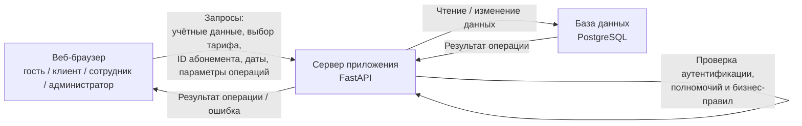

# Модель угроз

## Модель продукта

Актуальная архитектурная модель продукта состоит из веб-клиента, сервера приложения и базы данных PostgreSQL.

Сервер приложения отвечает за аутентификацию пользователей, проверку полномочий, предметную логику, проверку условий абонемента, регистрацию посещений и изменение данных в базе.

**Что уже существует:**

* Архитектурный подход и основные компоненты определены в `PROJECT.md`.
* Определены роли клиента, сотрудника клуба и администратора.
* Определены основные сценарии работы с абонементами, заморозкой и посещениями.
* Определён стек FastAPI, PostgreSQL, SQLAlchemy, JWT и Argon2id.
* Определено разделение серверной части на API, прикладные сценарии, доменные правила и инфраструктурные адаптеры.

**Что пока планируется:**

* Реализация первой запускаемой версии FastAPI-приложения с PostgreSQL.
* Реализация аутентификации и разграничения ролей.
* Реализация операций оформления и продления абонементов, заморозки и регистрации посещений.
* Реализация API для описанных пользовательских сценариев.

**Существенные допущения:**

* Запросы из браузера считаются недоверенными независимо от того, какие элементы интерфейса доступны пользователю.
* Сервер самостоятельно определяет пользователя и его полномочия и не должен доверять значениям, переданным клиентом для определения допустимого действия.
* JWT используется для передачи сведений о пользовательской сессии; конкретный протокол выдачи и проверки токенов в данной модели отдельно не анализируется.
* PostgreSQL является единственной обязательной внешней зависимостью продукта.
* Оплата абонемента находится вне границы продукта; сервис получает факт подтверждения оплаты от сотрудника клуба.
* Операции изменения связанных данных должны рассматриваться как единая предметная операция, а результат записи в базу не считается успешным до подтверждения сохранения.

## Границы доверия

| Граница                                 | Что пересекает                                                                                                                                     | Почему требуется проверка                                                                                                                                                                                                                |
| --------------------------------------- | -------------------------------------------------------------------------------------------------------------------------------------------------- | ---------------------------------------------------------------------------------------------------------------------------------------------------------------------------------------------------------------------------------------- |
| `TB-01: веб-клиент → сервер приложения` | Запросы на вход и регистрацию, идентификаторы объектов, даты заморозки, параметры операций, данные форм и другие значения, поступающие из браузера | Браузер находится под контролем пользователя и не считается доверенной стороной. Сервер должен самостоятельно проверять аутентификацию, полномочия, принадлежность объектов пользователю и допустимость значений                         |
| `TB-02: сервер приложения → PostgreSQL` | Запросы на чтение и изменение пользователей, ролей, абонементов, заморозок и посещений                                                             | Результат операции с БД нельзя считать подтверждённым автоматически: база может быть недоступна или операция может завершиться ошибкой. Для изменения состояния необходимо учитывать результат сохранения и целостность связанных данных |

Основной границей доверия для пользовательских атак является `TB-01`.

## Значимые объекты и свойства

Основными защищаемыми объектами являются:

* персональные данные клиентов: ФИО, телефон, электронная почта;
* данные абонементов: владелец, тариф, срок действия, остаток посещений, периоды заморозки;
* история посещений;
* учётные записи и роли пользователей;
* состояние абонемента и связанные с ним ограничения.

Для этих объектов важны конфиденциальность, разграничение полномочий, целостность и согласованность состояния, а также корректное поведение при отказе базы данных.

Связанные требования безопасности определены в `security_requirements.md`.

## Угрозы

| ID     | Сценарий угрозы                                                                                                                                                                                                                                                        | Что нарушается                                           | Граница / точка входа                                                 | Связанные SR              | Приоритет и обоснование                                                                                                                                                                                                                    |
| ------ | ---------------------------------------------------------------------------------------------------------------------------------------------------------------------------------------------------------------------------------------------------------------------- | -------------------------------------------------------- | --------------------------------------------------------------------- | ------------------------- | ------------------------------------------------------------------------------------------------------------------------------------------------------------------------------------------------------------------------------------------ |
| `T-01` | Гость отправляет напрямую запрос к операции, предназначенной только для авторизованного пользователя, и получает персональные данные клиента, данные абонемента или историю посещений без прохождения аутентификации                                                   | Конфиденциальность, идентичность пользователя            | `TB-01`, запросы к операциям личного кабинета и данным клиентов       | `SR-01`                   | **Высокий — приоритетный набор.** Последствием является раскрытие персональных данных постороннему лицу. Сценарий реалистичен, поскольку пользователь может обращаться к API напрямую, минуя интерфейс                                     |
| `T-02` | Авторизованный клиент изменяет переданный в запросе идентификатор клиента или абонемента и получает персональные данные или историю другого клиента                                                                                                                    | Конфиденциальность, разграничение доступа к данным       | `TB-01`, операции просмотра данных клиента и абонемента               | `SR-01`, `SR-03`          | **Высокий — приоритетный набор.** Используется обычный корректно сформированный запрос с другим идентификатором. Нарушение возможно непосредственно на основной границе доверия                                                            |
| `T-03` | Клиент напрямую вызывает операцию, доступную сотруднику или администратору, либо изменяет параметры запроса так, чтобы сервер выполнил действие с более высоким уровнем полномочий: например, подтверждение оплаты, изменение абонемента или управление ролями         | Авторизация и целостность состояния                      | `TB-01`, защищённые операции управления пользователями и абонементами | `SR-02`                   | **Высокий — приоритетный набор.** Нарушение ролевой модели может дать пользователю возможность изменять критичные данные или выполнять административные действия. Прямой вызов API реалистичен и не зависит от наличия кнопки в интерфейсе |
| `T-04` | Клиент отправляет запрос на изменение защищаемых параметров абонемента, подставляя владельца, срок действия, остаток посещений или другие значения, которые он не должен определять самостоятельно. При отсутствии серверной проверки изменённое состояние сохраняется | Целостность данных абонемента                            | `TB-01`, операции изменения и продления абонемента                    | `SR-04`                   | **Высокий — приоритетный набор.** Последствием может стать неоплаченный доступ, потеря оплаченного доступа или ошибочное списание посещений. Эти данные относятся к основному состоянию продукта                                           |
| `T-05` | Сотрудник или другой участник выполняет повторно один и тот же корректный запрос регистрации посещения. В результате создаётся несколько записей одного визита и/или посещение списывается более одного раза                                                           | Целостность и согласованность учёта посещений            | `TB-01`, операция регистрации посещения                               | `SR-05`                   | **Средний.** Сценарий может возникнуть даже без злонамеренной подмены данных: например, из-за повторной отправки запроса. Последствие непосредственно затрагивает остаток посещений и историю                                              |
| `T-06` | Клиент отправляет несколько корректных запросов на заморозку с периодами, которые по отдельности проходят проверку, но вместе приводят к пересечению заморозок или превышению общего лимита доступных дней                                                             | Целостность состояния абонемента                         | `TB-01`, операция оформления заморозки                                | `SR-06`                   | **Средний.** Угроза возникает из сочетания нескольких запросов и может привести к условиям абонемента, не предусмотренным тарифом. Особенно важна для будущего выбора способа атомарной проверки и изменения состояния                     |
| `T-07` | Пользователь выполняет предусмотренный запрос к данным учётной записи, а сервер возвращает пароль или другой секрет сессии в ответе либо отображает его в доступных пользователю данных                                                                                | Конфиденциальность аутентификационных данных             | `TB-01`, операции просмотра данных учётной записи                     | `SR-07`                   | **Средний.** Раскрытие секрета может привести к компрометации учётной записи. Угроза не привязана к конкретной бизнес-операции, но должна учитываться для всех ответов API                                                                 |
| `T-08` | Во время изменения абонемента, регистрации посещения или заморозки возникает отказ PostgreSQL. Сервер сообщает об успешном выполнении либо сохраняет только часть связанных изменений                                                                                  | Целостность при отказе хранилища, согласованность данных | `TB-02`, операции записи в PostgreSQL                                 | `SR-08`, `SR-05`, `SR-06` | **Высокий — приоритетный набор.** База данных является обязательной зависимостью продукта. Некорректное поведение при её отказе может привести к ложным результатам и рассогласованию критичных данных                                     |

## Приоритетный набор

В приоритетный набор на текущем этапе входят:

`T-01`, `T-02`, `T-03`, `T-04`, `T-08`.

Эти угрозы должны в первую очередь повлиять на дальнейшие проектные решения, поскольку непосредственно затрагивают основную границу доверия, ролевое разграничение, конфиденциальность персональных данных, целостность состояния абонементов и корректность изменений при отказе базы данных.

`T-05`, `T-06` и `T-07` сохраняются в модели как релевантные, но на текущем этапе имеют меньший приоритет относительно выбранного набора.

## Оставшиеся разрывы модели

* В `PROJECT.md` пока не определены конкретные URL и форматы всех API-операций. До S04 следует уточнить точки входа для основных сценариев, не меняя смысл существующих `T-*`.
* В разделе источников данных `PROJECT.md` таблица пока не заполнена. Желательно явно зафиксировать в ней данные браузерных форм и параметры API, поскольку именно они являются основным недоверенным вводом.
* Способ передачи и хранения JWT в проекте ещё не детализирован. При уточнении архитектуры следует проверить, какие данные сессии пересекают границу `TB-01`.
* Для операций изменения абонемента и заморозки следует подтвердить, что проверки бизнес-условий и изменение связанных записей выполняются как единая согласованная операция.
