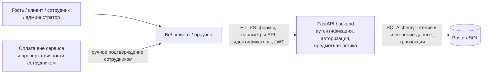

# Модель угроз

## Модель продукта

Веб-сервис предназначен для управления клубным членством в спортивном клубе. В системе предусмотрены четыре роли: гость, клиент клуба, сотрудник клуба и администратор. Основные сценарии включают регистрацию и вход, просмотр тарифов, оформление и продление абонемента, заморозку, регистрацию посещений сотрудником и административное управление тарифами, пользователями и ролями.

Актуальное описание продукта, ролей и сценариев приведено в [PROJECT.md](./PROJECT.md).

### Архитектурный вид

Сервер приложения является компонентом, который принимает решения о допустимости операций: устанавливает личность пользователя по механизму аутентификации, проверяет его роль и полномочия, проверяет предметные ограничения и только после этого читает или изменяет данные в PostgreSQL.

Основные точки входа:

- регистрация и вход;
- запросы личного кабинета клиента;
- просмотр данных абонемента и истории посещений;
- оформление и продление абонемента;
- запрос заморозки;
- регистрация посещения сотрудником;
- подтверждение оплаты сотрудником;
- административные операции с тарифами, пользователями и ролями;
- технические endpoint'ы состояния приложения.

**Что уже существует:**

- запускаемая техническая основа FastAPI-приложения;
- подключение к PostgreSQL и миграции Alembic;
- локальный запуск через Docker Compose;
- технические endpoint'ы проверки состояния приложения;
- Swagger UI для просмотра доступных API-методов.

**Что пока планируется или дорабатывается:**

- полная реализация регистрации, входа и разграничения ролей;
- операции с тарифами и абонементами;
- оформление и продление абонемента после подтверждения оплаты;
- заморозка с проверкой лимитов и пересечений;
- регистрация посещений и согласованное списание остатка посещений;
- административные операции с тарифами, пользователями и ролями.

**Существенные допущения:**

- клиентская сторона и все данные, пришедшие в HTTP-запросе, считаются недоверенными;
- клиент не должен иметь возможность самостоятельно задавать свою роль, владельца абонемента, подтверждение оплаты, остаток посещений или иные защищаемые поля;
- идентификатор и роль текущего пользователя должны определяться сервером из проверенного контекста аутентификации, а не приниматься как доверенный параметр запроса;
- прямой доступ пользователей к PostgreSQL отсутствует;
- все изменения состояния выполняются через серверную часть;
- соединение пользователя с сервисом при развёртывании предполагается защищённым HTTPS;
- внешняя платёжная система не интегрируется с приложением: оплату проверяет сотрудник вне сервиса, а в приложение вносится только результат подтверждения;
- сервер должен сохранять согласованное состояние при сбоях PostgreSQL и не сообщать об успешной операции, если изменения не были сохранены.

## Границы доверия

| Граница | Что пересекает | Почему требуется проверка |
| --- | --- | --- |
| Пользователь / браузер -> FastAPI backend | Логин, пароль, JWT, идентификаторы пользователей и абонементов, выбранный тариф, даты заморозки, команды оформления, продления, регистрации посещения и административные команды | Пользователь полностью контролирует HTTP-запрос и может вызвать API напрямую, изменить скрытые параметры, идентификаторы, тело запроса или попытаться выполнить функцию другой роли |
| Контекст аутентификации -> проверка полномочий и предметная логика | Идентификатор текущего пользователя, роль и связанные с сессией данные | Нельзя разрешать операцию только по данным, заявленным клиентом; сервер должен установить подлинность пользователя и самостоятельно проверить полномочия для каждой операции |
| FastAPI backend -> PostgreSQL | Запросы чтения и изменения пользователей, ролей, тарифов, абонементов, периодов заморозки и посещений; начало, фиксация и откат транзакций | Ошибка хранилища или частичное выполнение нескольких связанных изменений не должны приводить к несогласованному состоянию или ложному ответу об успехе |
| Внешняя оплата / проверка личности -> ввод сотрудника в сервис | Результат проверки оплаты, идентификатор клиента или абонемента, команда подтверждения или регистрации посещения | Сервис сам не получает данные от платёжной системы и должен принимать такие действия только от роли сотрудника или администратора, не позволяя клиенту подтвердить оплату или посещение самостоятельно |

## Значимые объекты и свойства

Основные значимые объекты описаны в [PROJECT.md, раздел 5](./PROJECT.md#5-значимые-данные-и-другие-объекты), а требуемые защитные свойства — в [SECURITY_REQUIREMENTS.md](./SECURITY_REQUIREMENTS.md).

Для модели угроз особенно важны:

- **персональные данные клиента** - должны быть доступны только самому клиенту и уполномоченным сотрудникам/администратору;
- **роль и учётная запись пользователя** - нельзя позволить клиенту получить полномочия сотрудника или администратора;
- **данные абонемента** - владелец, тариф, срок действия, остаток посещений и другие защищаемые поля должны изменяться только разрешёнными операциями;
- **периоды заморозки** - не должны пересекаться или превышать доступный лимит, а изменение срока действия должно оставаться согласованным;
- **история посещений и остаток посещений** - одна регистрация посещения должна приводить ровно к одной записи и одному списанию там, где оно требуется;
- **пароли, JWT и другие секреты сессии** - не должны раскрываться через ответы сервиса;
- **согласованность состояния при сбоях** - частичное изменение нескольких связанных объектов или ложный ответ об успешной записи недопустимы.

## Угрозы

| ID | Сценарий угрозы | Что нарушается | Граница / точка входа | Связанные SR | Приоритет и обоснование |
| --- | --- | --- | --- | --- | --- |
| **T-01** | Гость без аутентификации напрямую вызывает защищённый API личного кабинета, абонемента или истории посещений и пытается получить данные клиента | Конфиденциальность персональных данных и данных абонемента | Пользователь / браузер -> API; защищённые GET-запросы | SR-01 | **Высокий.** Сценарий реалистичен для любого публичного HTTP API и при успехе раскрывает защищённые данные; отдельно в приоритетный набор не включён, поскольку базовая аутентификация также является предпосылкой для T-02 и T-03 |
| **T-02** | Авторизованный клиент подставляет в запрос идентификатор другого клиента или чужого абонемента и пытается получить его персональные данные, сведения об абонементе или историю посещений | Конфиденциальность и разграничение доступа к данным | Пользователь / браузер -> API; параметры пути, query или body с идентификаторами | SR-01, SR-03 | **Высокий, приоритетный.** Идентификаторы объектов являются недоверенным вводом; ошибка проверки владельца напрямую нарушает один из основных сценариев личного кабинета |
| **T-03** | Клиент или сотрудник вызывает API функции более привилегированной роли: клиент пытается подтвердить оплату, зарегистрировать посещение или изменить абонемент как сотрудник; сотрудник пытается изменить тарифы, роли или учётные записи как администратор | Авторизация, целостность абонементов и ролей | Пользователь / браузер -> API; служебные и административные операции | SR-02, SR-04 | **Высокий, приоритетный.** В продукте специально предусмотрены различающиеся роли; ошибка проверки полномочий позволяет менять состояние продукта без разрешения |
| **T-04** | Клиент изменяет параметры операции с абонементом: передаёт недопустимые даты заморозки, период сверх лимита, пересекающийся период либо пытается передать защищаемые поля вроде срока действия или остатка посещений напрямую | Целостность состояния абонемента и правил заморозки | Пользователь / браузер -> API; оформление, продление и заморозка | SR-04, SR-06 | **Высокий, приоритетный.** Запрос синтаксически может быть корректным, но нарушать предметные правила и давать неоплаченные преимущества |
| **T-05** | Сотрудник или клиент повторно отправляет один и тот же запрос регистрации посещения либо два одинаковых запроса обрабатываются почти одновременно; сервис создаёт две записи или дважды списывает посещение | Целостность и согласованность истории посещений и остатка посещений | Пользователь / браузер -> API; регистрация посещения; обработка транзакции | SR-05 | **Высокий, приоритетный.** Посещение - основной сценарий продукта, а повторная отправка HTTP-запроса или конкурентные запросы реалистичны и могут привести к неверному учёту |
| **T-06** | Во время операции, меняющей несколько связанных объектов, PostgreSQL становится недоступен или возникает ошибка после части действий; сервис сохраняет только часть состояния либо возвращает клиенту успешный ответ, хотя транзакция не была зафиксирована | Целостность и безопасное состояние при сбое | Backend -> PostgreSQL; оформление/продление, заморозка, регистрация посещения | SR-05, SR-08 | **Высокий, приоритетный.** Сценарий влияет на архитектуру транзакций и обработку ошибок; несогласованность может дать лишнее посещение или, наоборот, лишить клиента оплаченного доступа |
| **T-07** | API при просмотре пользователя, отладочном ответе или ошибке сериализует пароль, хэш пароля, JWT или другой секрет сессии и возвращает его пользователю | Конфиденциальность аутентификационных данных | Ответы backend/API | SR-07 | **Средний.** Последствия серьёзные, но сценарий менее связан с основными предметными операциями, чем ошибки доступа и изменения абонемента |
| **T-08** | Пользователь изменяет содержимое JWT или передаёт поддельный токен с идентификатором/ролью сотрудника или администратора, а сервер принимает эти данные без корректной проверки подлинности токена | Подлинность пользователя, авторизация и целостность данных | Пользователь / браузер -> механизм аутентификации -> API | SR-02, SR-07 | **Высокий.** При успехе злоумышленник получает полномочия другой роли; угроза должна учитываться при реализации JWT-аутентификации |

## Приоритетный набор

В приоритетный набор включены **T-02, T-03, T-04, T-05 и T-06**.

Они выбраны потому, что непосредственно относятся к основным сценариям продукта и должны влиять на дальнейшие проектные решения: проверку прав на конкретный объект, разграничение ролей, серверную проверку предметных ограничений, защиту от повторного выполнения операции и транзакционную согласованность при работе с PostgreSQL.

T-01, T-07 и T-08 также существенны и должны учитываться при реализации аутентификации и API, однако в текущем приоритетном наборе основной фокус сделан на сценариях, наиболее тесно связанных с предметной логикой абонементов, заморозки и посещений.
